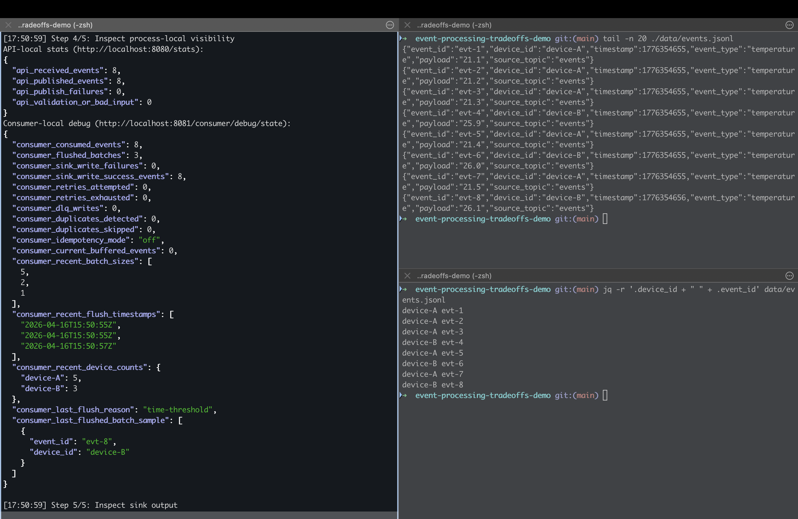
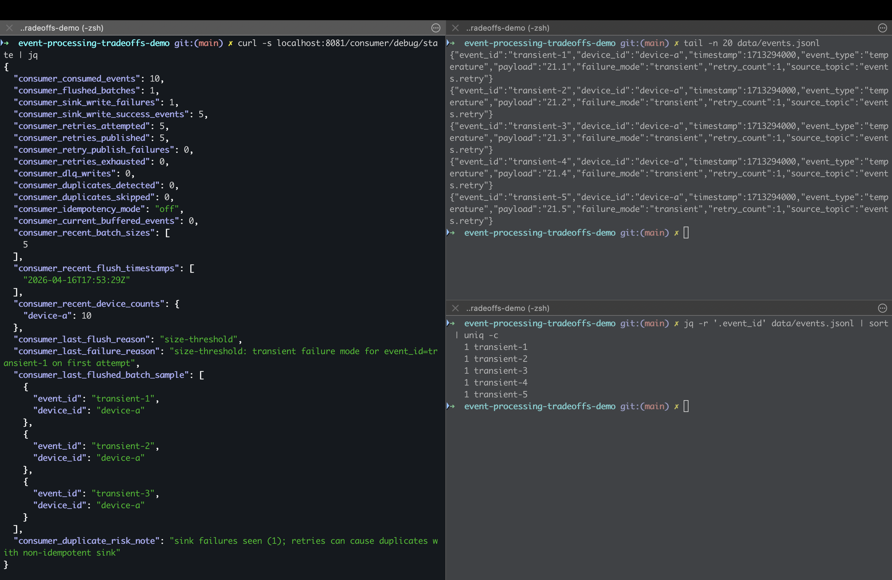
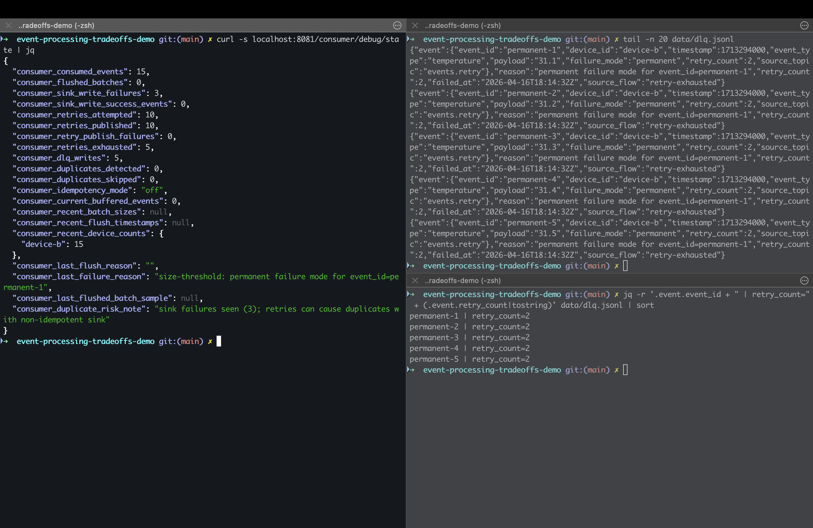
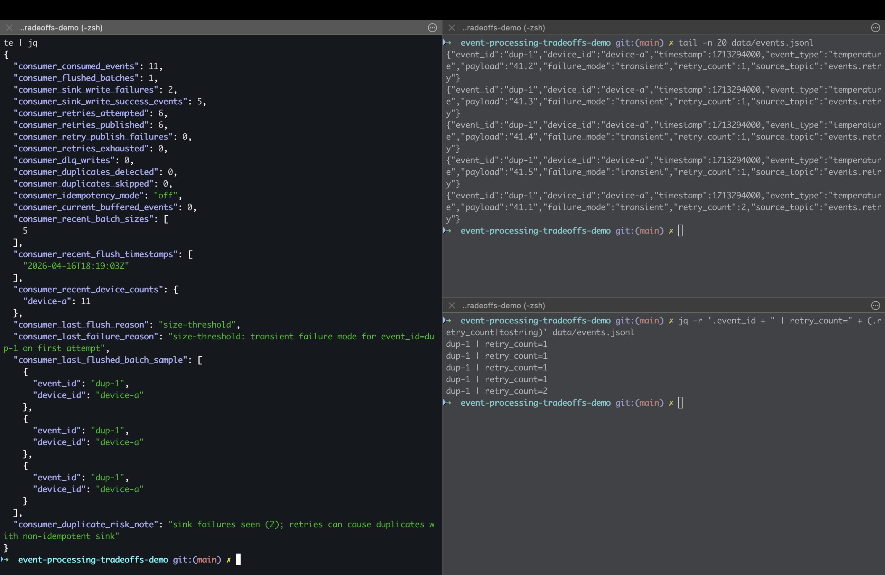
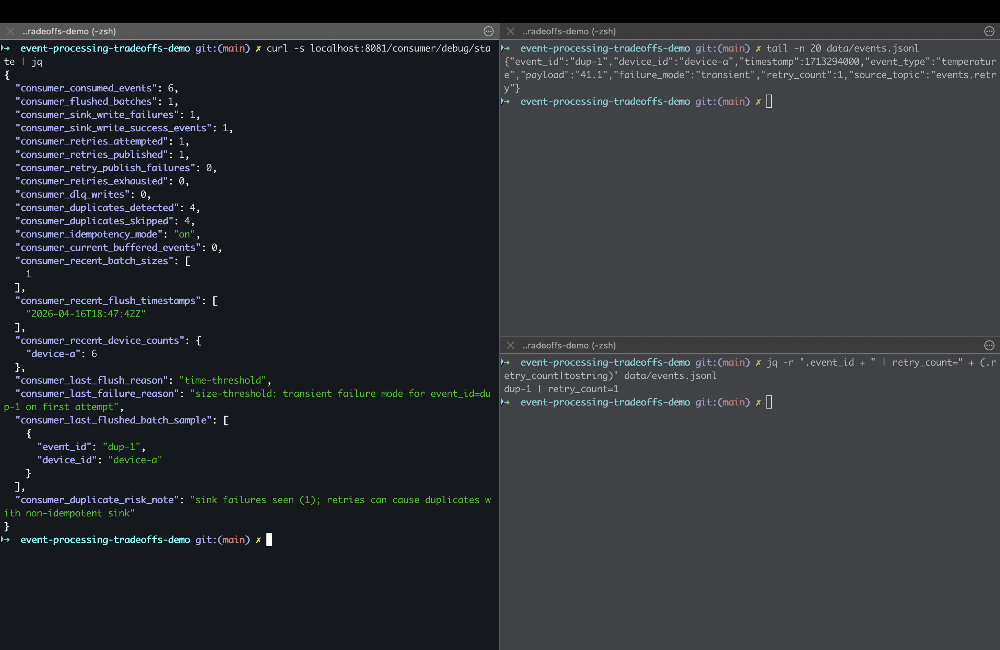

# Event-Driven Systems Trade-offs Demo

This repository demonstrates practical trade-offs in event-driven systems, with a focus on behavior under failure, retries, duplicates, batching, and downstream processing constraints.

The goal is to make event-driven behavior observable: what happens when messages fail, retries occur, duplicates arrive, and consumers must balance correctness, latency, and throughput.

## What You Will Learn

Event-driven systems are often described as scalable and resilient, but those benefits come with design choices that need to be made explicitly.

This demo focuses on the following concepts:

- **Ordering vs Throughput** — strict ordering limits parallelism
- **At-least-once Delivery** — retries prevent data loss, but duplicates become expected
- **Idempotency** — correctness under retries requires durable state
- **Transient vs Permanent Failures** — retryable failures and poison messages need different handling
- **Dead Letter Queues** — failed messages can be isolated, but not forgotten
- **Batching vs Latency** — larger batches improve efficiency, but delay processing

---

## Scenarios and Trade-offs

| Scenario | What Happens | Trade-off |
|----------|-------------|----------|
| Baseline | Events are processed normally | Ideal flow with no failures |
| Transient failure | Processing fails temporarily, then succeeds after retry | Better resilience, but higher latency and duplicate risk |
| Permanent failure | Retries are exhausted and the message is routed to the DLQ | Pipeline continues, but the message requires operational follow-up |
| Idempotency OFF | Duplicate events are processed more than once | Simpler implementation, but unsafe under retries |
| Idempotency ON | Duplicate events are detected and skipped | Safer processing, but requires state and consistency guarantees |
| Batching | Events are processed in groups | Higher throughput, but increased latency and more complex failure behavior |

---

## Scenarios

### Scenario 1 — Baseline: healthy path

**Run**

```bash
make compose-up
make demo-ordering
```

**Observe**

- `consumer_retries_attempted = 0`
- `consumer_dlq_writes = 0`
- no duplicate `event_id`



This scenario represents the ideal case: events are produced, consumed, and written to the downstream sink without failures.

In real systems, this is the easy path. The more interesting question is what happens when the consumer fails, the downstream system becomes unavailable, or the same event is delivered more than once.

---

### Scenario 2 — Transient failure: retry succeeds

**Run**

```bash
./scripts/demo-retry-dlq-idempotency.sh
```

**Observe**

- retries increase
- events eventually succeed
- DLQ remains unused



Transient failures are temporary failures such as network timeouts, short downstream outages, or temporary rate limits.

Retries improve resilience because the system can recover without manual intervention. The trade-off is that retries increase end-to-end latency and may cause the same event to be processed more than once.

This is why retry handling and idempotency are usually designed together.

---

### Scenario 3 — Permanent failure: message goes to DLQ

**Run**

```bash
./scripts/demo-retry-dlq-idempotency.sh
```

**Observe**

- retries are exhausted
- failed event is written to `dlq.jsonl`



Permanent failures are failures where retrying the same message is unlikely to help. Examples include invalid payloads, unsupported event versions, missing required fields, or poison messages that always crash the consumer.

A Dead Letter Queue prevents one bad message from blocking the entire pipeline. The trade-off is operational: the message has not really been handled yet. It has only been isolated.

A DLQ is therefore not a final solution. It requires monitoring, alerting, investigation, and a replay or compensation strategy.

---

### Scenario 4 — Idempotency OFF: duplicates are processed

**Run**

```bash
IDEMPOTENCY_MODE=off docker compose -f deploy/docker-compose.yml up --build -d
./scripts/demo-retry-dlq-idempotency.sh
```

**Observe**

- duplicate `event_id` appears in output



Without idempotency, duplicate delivery can lead to duplicate side effects.

This is especially dangerous in systems that trigger external actions, update balances, create records, send notifications, or write analytics data that should only be counted once.

The advantage of this approach is simplicity. The consumer does not need to store processed event IDs or coordinate with an external state store. The downside is that the system is only safe if duplicate processing is acceptable.

---

### Scenario 5 — Idempotency ON: duplicates are skipped

**Run**

```bash
IDEMPOTENCY_MODE=on docker compose -f deploy/docker-compose.yml up --build -d
./scripts/demo-retry-dlq-idempotency.sh
```

**Observe**

- duplicates are detected
- repeated `event_id` values are skipped



With idempotency enabled, the consumer records which events have already been processed and skips duplicates.

This makes retries safer under at-least-once delivery. The trade-off is additional state, storage, and consistency complexity. The system now depends on the correctness of the idempotency ledger.

In production, this state usually needs to survive restarts and be shared across consumer instances.

---

## Architecture Overview

```text
Producer
   |
   v
Event Stream
   |
   v
Consumer
   |
   +--> Idempotency Layer
   |
   +--> Batching Layer
   |
   v
Sink / Downstream System

Failures after retry exhaustion are written to the Dead Letter Queue.
```

Components:

- **Producer** — generates events
- **Consumer** — processes events from the stream
- **Idempotency Layer** — prevents duplicate side effects
- **Batching Layer** — improves throughput by grouping events
- **Sink** — represents a downstream system
- **Dead Letter Queue** — isolates messages that cannot be processed successfully

---

## Architecture Decisions

### At-least-once delivery

At-least-once delivery is often preferred in event-driven systems because it reduces the risk of data loss. If processing fails, the message can be retried.

The trade-off is that duplicates are expected behavior, not an edge case. Consumers must either tolerate duplicates or actively prevent duplicate side effects.

### Idempotent consumer

An idempotent consumer allows the same event to be received multiple times while producing the same final result.

This is important when retries are enabled. Without idempotency, retrying a message can accidentally repeat business actions.

The trade-off is that idempotency requires state. The system must remember which events were processed, and that state must be consistent enough to protect the downstream side effect.

### Dead Letter Queue

A DLQ protects the main pipeline from messages that repeatedly fail.

This improves availability because one poison message does not stop all other processing. However, DLQ messages still represent unfinished work.

The trade-off is operational complexity. A production DLQ needs alerting, ownership, inspection tools, replay logic, and rules for when a message should be fixed, discarded, or compensated.

### Batching

Batching improves throughput by reducing per-message overhead. This is useful when writing to databases, analytics stores, object storage, or external APIs.

The trade-off is latency. A message may wait in memory until the batch is full or a timeout is reached.

Batching also changes failure behavior. If a batch write fails, the system must decide whether to retry the whole batch, split it, skip invalid records, or send failed records to a DLQ.

### Ordering

Strict ordering makes reasoning about event sequences easier, especially when events represent state transitions.

The trade-off is reduced parallelism. If all events for a key must be processed in order, then processing for that key cannot be freely parallelized.

In real systems such as Kafka-based pipelines, ordering requirements strongly influence partitioning strategy, throughput, and consumer scaling.

---

## Quick Demo

```bash
./scripts/demo-ordering-batching.sh
```

---

## Observability

```bash
curl -s localhost:8080/stats | jq
curl -s localhost:8081/consumer/debug/state | jq
```

The demo exposes runtime state so the behavior of retries, duplicates, DLQ writes, and consumer processing can be inspected directly.

---

## How This Maps to Real Systems

The same trade-offs appear in production systems such as:

- Kafka-based pipelines
- payment or notification processing
- ClickHouse or analytics ingestion
- asynchronous microservice workflows
- outbox/inbox patterns
- event-driven integration systems

The exact technology may differ, but the design questions are similar:

- Can this message be processed more than once?
- What happens if the consumer crashes after the side effect?
- Should failed messages block the pipeline or be isolated?
- Is ordering required globally, per key, or not at all?
- Is low latency more important than write efficiency?
- Who owns DLQ investigation and replay?

---

## Production Considerations

A production version of this design would usually require:

- durable idempotency storage such as Redis, PostgreSQL, or a compacted Kafka topic
- clear retry policy with backoff and retry limits
- DLQ monitoring, alerting, inspection, and replay tooling
- schema evolution and compatibility rules
- consumer lag monitoring
- partitioning strategy based on ordering requirements
- metrics for retries, duplicate detection, failed messages, and batch flushes
- safe shutdown and rebalance handling

---

## Trade-offs Summary

| Approach | Benefit | Downside |
|----------|---------|----------|
| At-most-once delivery | Low latency and simple processing | Possible data loss |
| At-least-once delivery | Better durability through retries | Duplicate processing risk |
| Exactly-once semantics | Stronger correctness guarantees | Performance and operational complexity |
| Idempotent consumer | Safe retry handling | Requires durable state |
| DLQ | Prevents poison messages from blocking the pipeline | Requires operational ownership |
| Batching | Higher throughput | Higher latency and more complex failure handling |
| Strict ordering | Easier reasoning about event sequence | Lower parallelism |

---

## Summary

This demo highlights a core distributed systems principle:

> Event-driven architecture is not about avoiding failure. It is about making failure explicit, observable, and recoverable.

Retries improve resilience, but they introduce duplicate-processing risk. Dead Letter Queues prevent poison messages from blocking the pipeline, but they create operational follow-up work. Idempotency makes at-least-once delivery safe, but it requires durable state and additional consistency guarantees. Batching improves throughput, but increases latency and changes failure behavior.

The main lesson is that there is no universally correct event-driven design. Reliable systems are built by choosing trade-offs deliberately: ordering vs throughput, latency vs efficiency, simplicity vs correctness, and automation vs operational control.
